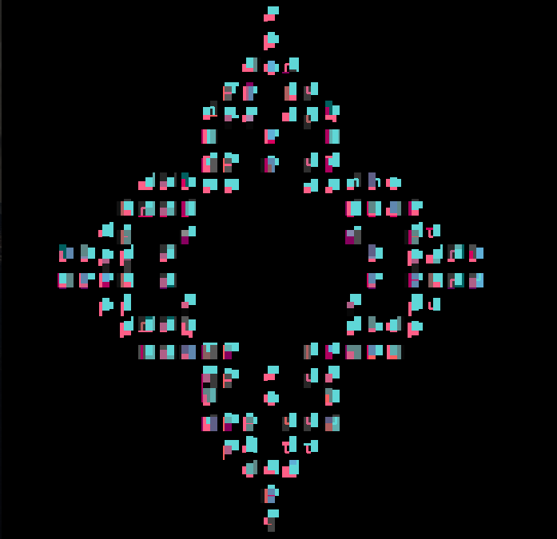
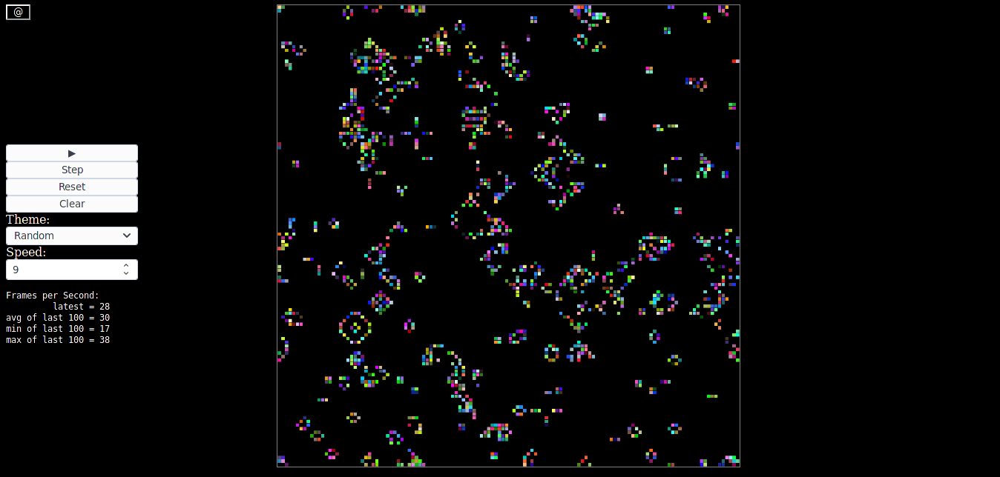

# Convida



An implementation of [Conway's Game of Life](https://en.wikipedia.org/wiki/Conway%27s_Game_of_Life) based on this [tutorial](https://rustwasm.github.io/docs/book/game-of-life/introduction.html).

## Release

To start the server, enter:

```
cd www
npm install
npm run start
```

[](https://convida.liambeckman.com)

## Development

### Dependencies

wasm-pack
- [Quick start method](https://rustwasm.github.io/wasm-pack/installer/#)
- Cargo method: `cargo install wasm-pack`

rust
- [Quick start method](https://www.rust-lang.org/learn/get-started)

Then, within the convida directory, enter:

```sh
wasm-pack build
```

to build the Rust code in `src/lib.rs` to the `pkg` directory.

## Alternatives

- http://golly.sourceforge.net/
- https://copy.sh/life/

## Improvements on the Tutorial

- Introduce an `<input type="range">` widget to control how many ticks occur per animation frame.
- Add a button that resets the universe to a random initial state when clicked. Another button that resets the universe to all dead cells.
- On Ctrl + Click, insert a glider centered on the target cell. On Shift + Click, insert a pulsar.

